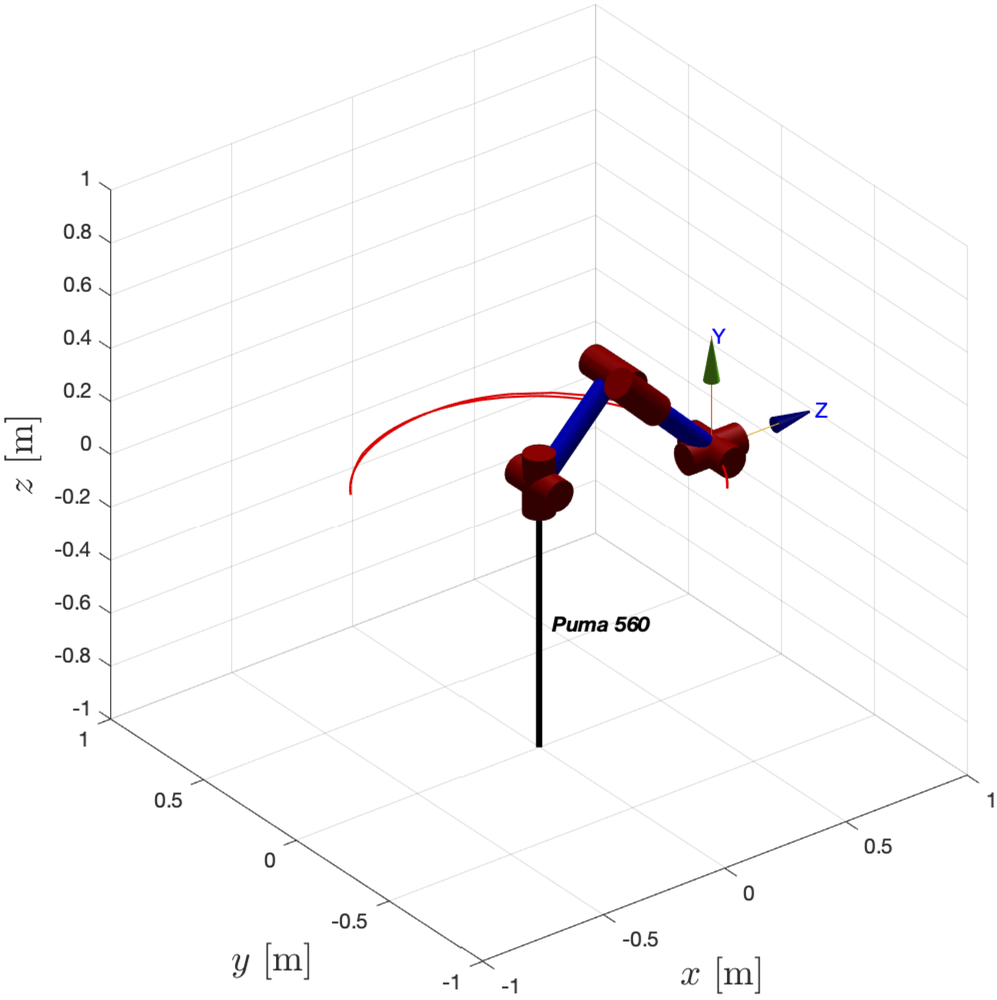
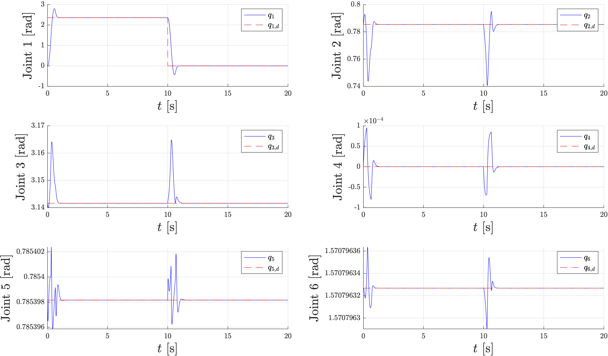
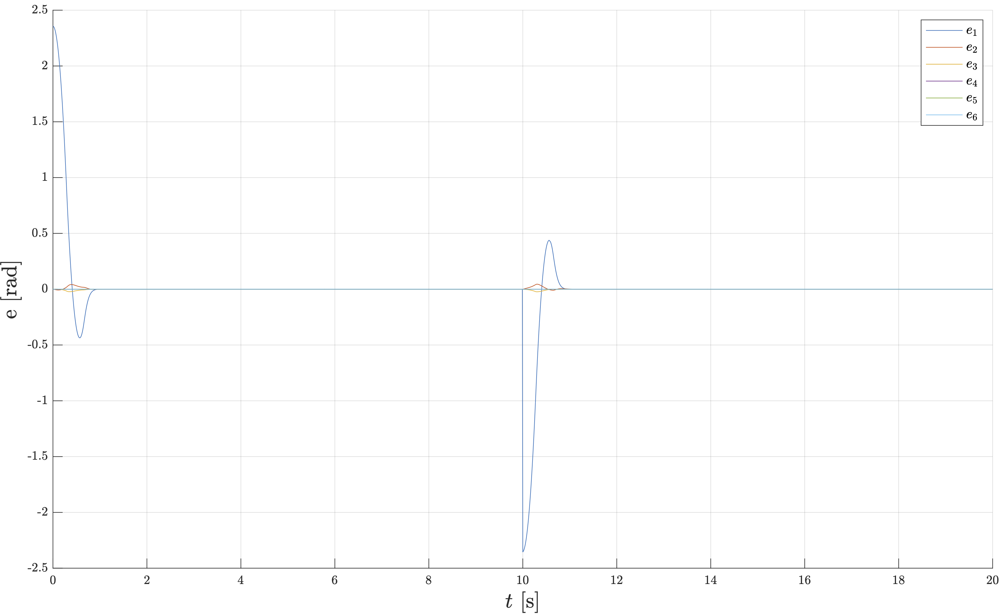
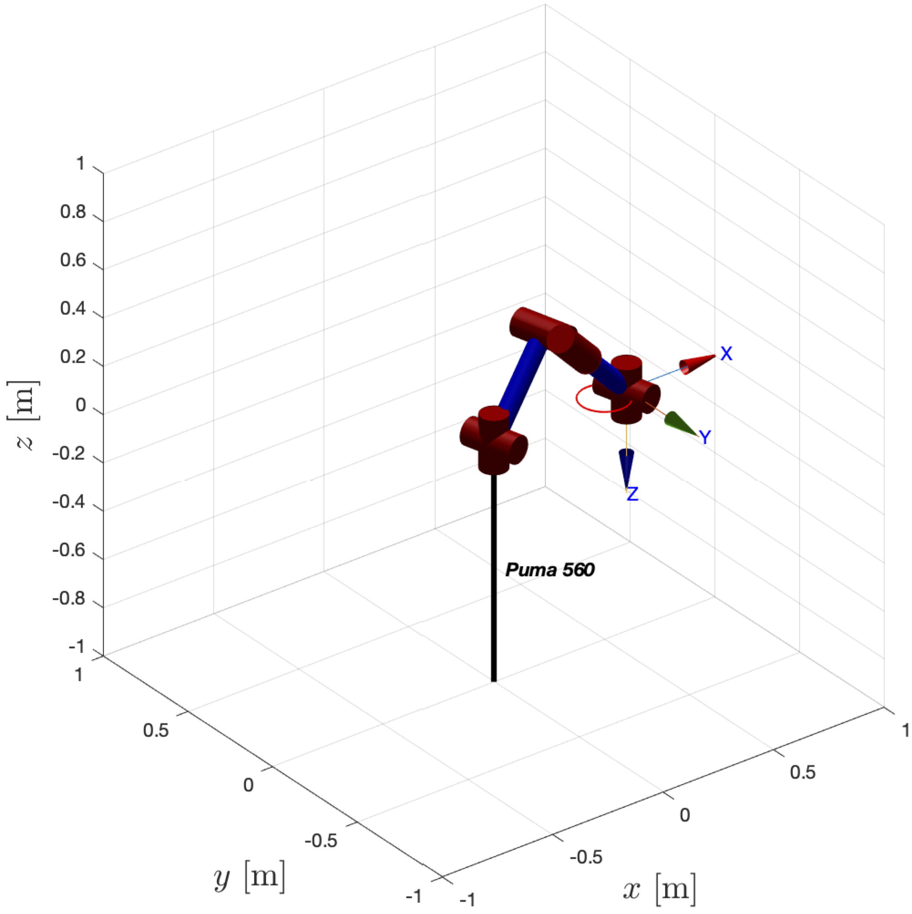
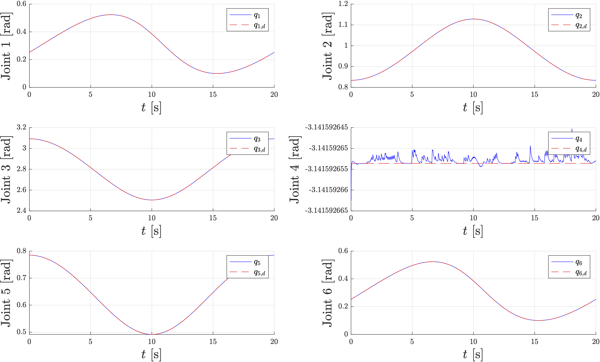
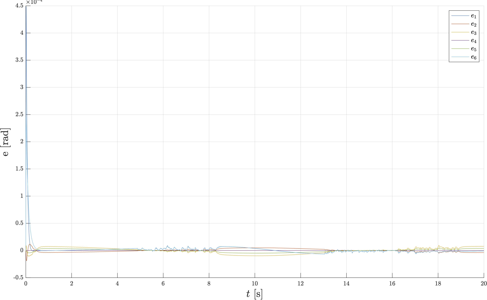

# PUMA 560: Control of a 6-DOF Robot Arm

This is a project for controlling a fully-actuated robot arm with six degrees of freedom (DOF). The manipulator is a PUMA 560 with six rotoidal joints. The manipulator's description and Denavit-Hartenberg table are based on [[1]](#references-1), and the regression matrix was computed using [[2]](#references-2).

	<a href="#prerequisites">Prerequisites</a>
	 • 
	<a href="use">Use</a>
	 • 
	<a href="doc/presentation.pdf">Presentation</a>
	 • 
	<a href="#sample-images">Sample Images</a>

## Overview
The project includes several control aspects, including inverse kinematic control, dynamic control, and adaptive control. The following is a list of the simulations and techniques included in the project:

### Inverse Kinematic Control
* Gradient descent method for posture control
* Levenberg-Marquardt method for posture control and circular trajectory tracking
* Newton-Raphson method is not used due to its instability in singular configurations of the Jacobian

### Dynamic Control
* Proportional-Derivative (PD) controller synthesis and simulation for pick and place task
* Computed torque controller synthesis and simulation for pick and place task and circular trajectory tracking
* Backstepping controller synthesis and simulation for pick and place task and circular trajectory tracking

### Adaptive Control
* Computed torque adaptive controller synthesis and simulation for trajectory tracking using Finite Fourier Series (FFS) and parameter estimation
* Backstepping adaptive controller synthesis and simulation for trajectory tracking using FFS and parameter estimation

## Prerequisites
1. [Robotics Toolbox for MATLAB](https://petercorke.com/toolboxes/robotics-toolbox/) - a package that provides functions for the study and simulation of classical arm-type and mobile robotics
2. [SymPyBotics](https://github.com/cdsousa/SymPyBotics) - a Python-based symbolic framework used for modeling and identifying the dynamics of robots

## How to Use

### Non-Adaptive Control Methods

To use inverse kinematic (using gradient descent and Levenberg-Marquardt), proportional-derivative, computed torque control, or backstepping controllers, follow these steps:

1. Edit `src/main_puma560.m`:
	1. Choose a controller by modifying the `controller` variable:
		* `Kinematic_grad`: inverse kinematic using gradient descent method
		* `Kinematic_LevMar`: inverse kinematic using Levenberg-Marquardt method
		* `PD`: proportional-derivative
		* `CT`: computed torque
		* `BS`: backstepping
	2. Choose a task by modifying the `task` variable:
		* `position_control`: position control (compatible with `Kinematic_grad` and `Kinematic_LevMar`)
		* `pick_and_place`: pick and place (compatible with `PD`, `CT`, and `BS`)
		* `circular_trajectory_tracking`: circular trajectory tracking (compatible with `CT`, `BS`, and `Kinematic_LevMar`)
2. Edit `src/plot_Simulation.m`:
	1. Set `saving_flag` to 1 if you want to save plot images
	2. Set `title_flag` to 1 if you want to add titles to the plots
	3. Set `threeDplot_flag` to 1 if you want to plot the robot's trajectory in 3D space
	4. Set `image_extension` to the file format you want to use when saving the plots (if `title_flag` is 1), e.g., 'pdf', 'png', 'jpg'.
	5. Set `images_path` to the directory where you want to save the plot images (if `title_flag` is 1), e.g., '/Users/username/Documents/MATLAB/puma560-control/img/'
	6. Set `main_path` to the directory where the source code is located (if `title_flag` is 1), e.g., '/Users/username/Documents/MATLAB/puma560-control/src/'
3. Run `src/main_puma560.m`

### Adaptive Control Methods

To use adaptive computed torque and adaptive backstepping controllers:

1. Edit `src_adaptive/main_puma560_adaptive.m`:
	1. Choose a controller by modifying the `controller` variable:
		* `adaptiveCT`: adaptive computed torque
		* `adaptiveBS`: adaptive backstepping
	2. Choose a task by modifying the `task` variable:		* `position_control`: position control
		* `sinusoidal_trajectory_tracking`: sinusoidal trajectory tracking in joint space
		* `finite_fourier_series_trajectory_tracking`: Finite Fourier Series (FFS) trajectory tracking in joint space
2. Edit `src_adaptive/plot_adaptive.m`:
	1. Set `saving_flag` to 1 if you want to save plot images
	2. Set `title_flag` to 1 if you want to add titles to the plots
	3. Set `threeDplot_flag` to 1 if you want to plot the robot's trajectory in 3D space
	4. Set `image_extension` to the file format you want to use when saving the plots (if `title_flag` is 1), e.g., 'pdf', 'png', 'jpg'.
	5. Set `images_path` to the directory where you want to save the plot images (if `title_flag` is 1), e.g., '/Users/username/Documents/MATLAB/puma560-control/img/'
	6. Set `main_path` to the directory where the source code is located (if `title_flag` is 1), e.g., '/Users/username/Documents/MATLAB/puma560-control/src/'
3. Run `src_adaptive/main_puma560_adaptive.m`

## References
1. P. I. Corke and  B. Armstrong-Helouvry "A search for consensus among model parameters reported for the PUMA 560 robot" in Proceedings of the 1994 IEEE International Conference on Robotics and Automation, 1994, pp. 1608-1613 vol.2, doi:[10.1109/ROBOT.1994.351360](https://doi.org/10.1109/ROBOT.1994.351360).
2. C. D. Sousa and R. Cortesao, "SageRobotics: Open Source Framework for Symbolic Computation of Robot Models" in Proceedings of the 27th Annual ACM Symposium on Applied Computing, Trento, Italy, 2012, pp. 262-267, doi:[10.1145/2245276.2245329](https://doi.org/10.1145/2245276.2245329).

## Sample Images
Some images of the PUMA 560 robot during different simulations:

* End-effector trajectory (Lissajous, inverse kinematic controller)

     

### Backstepping
##### Pick and Place
* End-effector trajectory

     

* EE translation - orientation - XY view - 3D view

     

* Joint trajectories

     

* Joint errors

     

##### Pick and Place
* End-effector trajectory

    

* EE translation - orientation - XY view - 3D view

     

* Joint trajectories

     

* Joint errors

     

