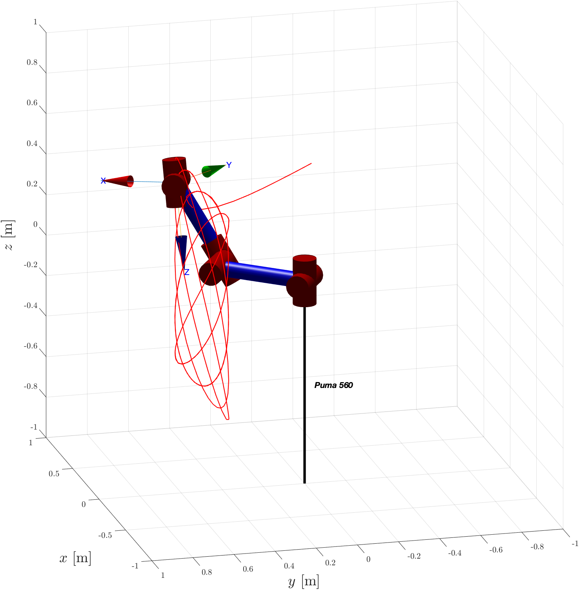

# Control of a 6-DOF Serial Manipulator

This is a project for controlling a fully-actuated 6-DOF serial manipulator. The manipulator used is a PUMA 560 with six rotoidal joints. The manipulator's description and Denavit-Hartenberg table are based on [[1]](#references-1).

## Overview
The project includes several aspects of control, including kinematic control, dynamic control, and adaptive control. The following is a list of the simulations and techniques included in the project:

### Kinematic Control
* Steepest descent method for posture control
* Levenberg-Marquardt method for posture control and circular trajectory tracking
* Newton-Raphson method is not used due to its instability in singular configurations of the Jacobian

### Dynamic Control
* PD controller synthesis and simulation for pick and place task
* Computed torque controller synthesis and simulation for pick and place task and circular trajectory tracking
* Backstepping controller synthesis and simulation for pick and place task and circular trajectory tracking

### Adaptive Control
* Computed torque adaptive controller synthesis and simulation for trajectory tracking using Finite Fourier Series (FFS) and parameter estimation
* Backstepping adaptive controller synthesis and simulation for trajectory tracking using FFS and parameter estimation

## How to Use
The project provides simulations and synthesis techniques for controlling the manipulator. Each section includes a brief explanation of the approach and a simulation. The code is provided in Matlab.

## References
1. Corke, P. I.;  Armstrong-Helouvry, B. "A search for consensus among model parameters reported for the PUMA 560 robot" Proceedings of the 1994 IEEE International Conference on Robotics and Automation, 1994, pp. 1608-1613 vol.2, doi:[10.1109/ROBOT.1994.351360](https://doi.org/10.1109/ROBOT.1994.351360).
 

## Images
Some images of the PUMA 560 robot during different simulations:

* End-effector trajectory (Lissajous, kinematic controller)

### Backstepping
##### Pick and Place
* End-effector trajectory

* EE translation - orientation - XY view - 3D view

* Joint trajectories

* Joint errors

##### Pick and Place
* End-effector trajectory

* EE translation - orientation - XY view - 3D view

* Joint trajectories

* Joint errors
